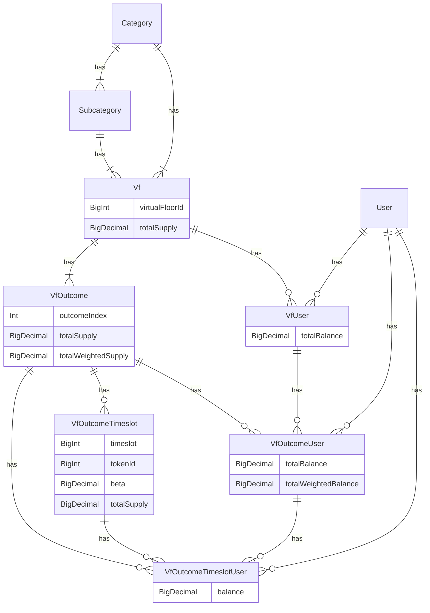

```mermaid
erDiagram
    Category ||--|{ Subcategory: has
    Subcategory ||--|{ Vf: has

    Category ||--|{ Vf: has

    Vf ||--|{ VfOutcome: has
    Vf ||--o{ VfUser: has

    VfOutcome ||--o{ VfOutcomeTimeslotUser: has
    VfOutcome ||--o{ VfOutcomeTimeslot: has
    VfOutcome ||--o{ VfOutcomeUser: has

    User ||--o{ VfUser: has
    User ||--o{ VfOutcomeUser: has
    User ||--o{ VfOutcomeTimeslotUser: has

    VfOutcomeUser ||--o{ VfOutcomeTimeslotUser: has
    VfOutcomeTimeslot ||--o{ VfOutcomeTimeslotUser: has

    VfUser ||--o{ VfOutcomeUser: has

    Vf {
        BigInt virtualFloorId
        BigDecimal totalSupply
    }
    VfOutcome {
        Int outcomeIndex
        BigDecimal totalSupply
        BigDecimal totalWeightedSupply
    }
    VfOutcomeTimeslot {
        BigInt timeslot
        BigInt tokenId
        BigDecimal beta
        BigDecimal totalSupply
    }
    VfOutcomeUser {
        BigDecimal totalBalance
        BigDecimal totalWeightedBalance
    }
    VfOutcomeTimeslotUser {
        BigDecimal balance
    }
    VfUser {
        BigDecimal totalBalance
    }
```
